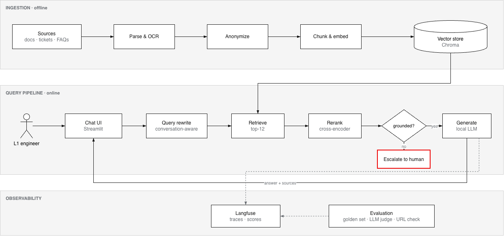
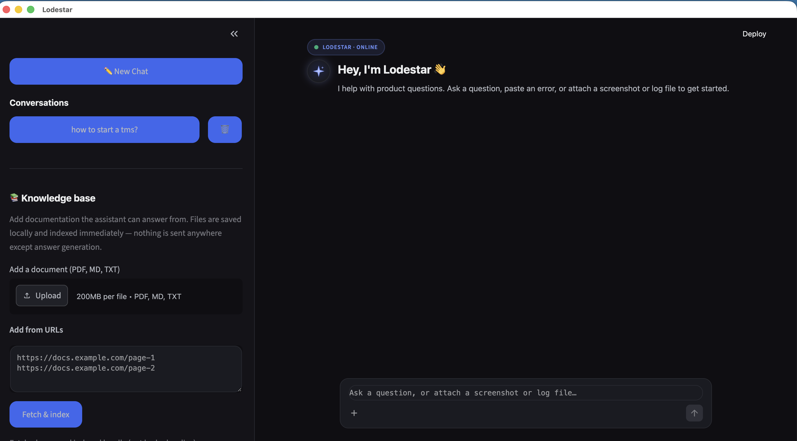
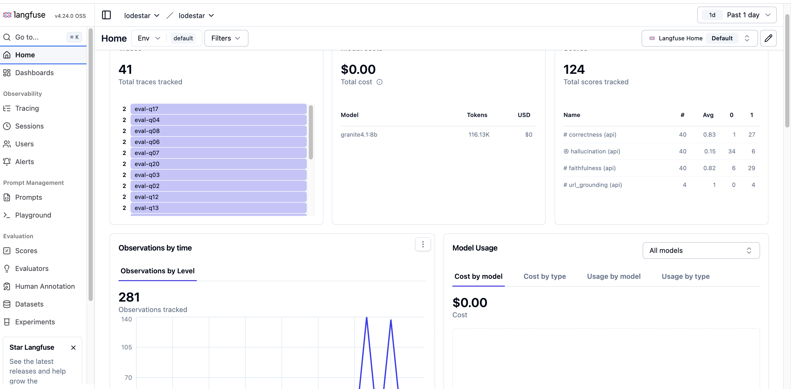

# Lodestar — AI Support Assistant

Lodestar is a local, documentation-grounded AI support assistant. Point it at your
product documentation and it answers customer and L1-support questions from that
material only, recognises known error signatures, reads screenshots and log files,
and hands over to a human engineer whenever the documentation does not cover the
question.

Everything runs on the local machine by default: the language model (IBM Granite via
Ollama), the embedding model, the reranker and the vector store. No data leaves the
machine.

---

## 1. What it does

| Capability | How |
|---|---|
| Answers product questions | Retrieval-augmented generation over `docs/` (Markdown, PDF, TXT) with a multilingual embedder and a cross-encoder reranker; the model writes the answer strictly from the retrieved context |
| Recognises known errors | `error_catalog.py` maps real-incident error signatures to causes, read-only diagnostics and resolution steps |
| Analyses attachments | Screenshots are transcribed by a vision model, log files are read as text, then analysed directly |
| Escalates instead of guessing | If neither the catalog nor the docs answer, the assistant says so and routes to a human |
| Remembers the conversation | Follow-up questions are rewritten into standalone queries using the last four turns |
| Grows its own knowledge base | From the sidebar: upload a file, fetch documentation URLs, or import resolved Jira tickets with two-pass redaction and human approval |
| Protects customer identity | Customer names are masked in every answer; Jira imports are pseudonymised (`CUST-XXXX`) and real account names are never stored |
| Is measurable | Langfuse traces per turn, `metrics.csv`, thumbs up/down feedback and an offline golden-set evaluation with an LLM judge |

---

## 2. Architecture



### How an answer is produced (`app.generate_reply`)

1. **Attachment** – a message carrying a screenshot or log is analysed directly,
   bypassing the routing below.
2. **Error catalog** – the raw text is matched against the signatures in
   `error_catalog.py`. A hit returns the curated causes, read-only diagnostics and
   resolution steps; destructive steps are flagged as requiring human approval.
3. **Documentation (RAG)** – the question (rewritten if it is a follow-up) goes to
   `rag.retrieve(k=12)`: Chroma vector search plus keyword search, merged and
   reranked by the cross-encoder. Chunks are then filtered by score:
   * documents with at least one chunk ≥ `LODESTAR_MIN_SOURCE_SCORE` (default
     **0.5**) are kept whole, so the model sees the full page or ticket;
   * if nothing clears that bar, the single best chunk is used only if it scores
     ≥ `LODESTAR_FALLBACK_SOURCE_SCORE` (default **0.3**);
   * the model answers only from that context. It must state plainly when the
     context does not answer the question, must never present example or
     placeholder values from the docs as real values, and returns
     `INSUFFICIENT_CONTEXT` when the context is unrelated.
4. **Escalation** – a fixed hand-off message to a human engineer.

Every answer passes through `_mask_blocks()` so no customer identifier reaches the UI.

---

## 3. Repository layout

| Path | Purpose |
|---|---|
| `app.py` | Streamlit app: UI and theme, routing, prompts, conversation persistence, metrics, sidebar ingestion tools |
| `rag.py` | Index build, retrieval, reranking and document ingestion helpers (`python rag.py --index`) |
| `error_catalog.py` | Known-error signature catalog (data plus `find_matches`) |
| `jira_sync.py` | Self-hosted Jira client (PAT auth), JQL builder, regex redaction, ticket-to-knowledge conversion |
| `redaction_audit.py` | Second-pass LLM masking of already-redacted text |
| `customer_map.py` | One-way customer pseudonyms and the solution-to-customer map (never read by the assistant) |
| `judge.py` | Scores one existing Langfuse trace (faithfulness, URL grounding) with a local judge model |
| `run_eval.py`, `judge_prompt.md` | Offline golden-set evaluation; expects a local `golden.jsonl` (see §6) |
| `docs/` | Your knowledge base: Markdown, PDF and text files (git-ignored) |
| `chroma_store/` | Persistent Chroma vector index (generated, git-ignored) |
| `conversations/` | Saved chats as JSON (generated, git-ignored) |
| `metrics.csv` | One row per turn: route, sources, latency, tokens, cost, feedback (generated, git-ignored) |
| `.streamlit/config.toml` | Dark theme |
| `Setup (run once).command`, `Build Index.command`, `Lodestar.command` | macOS double-click scripts: install, index, launch |

---

## 4. Setup

### Requirements

* macOS or Linux, Python 3.12+
* [Ollama](https://ollama.com) running locally with these models:
  ```bash
  ollama pull granite4.1:8b          # text model: answers, query rewriting, judge
  ollama pull granite3.2-vision      # screenshot transcription
  ```


### Install

```bash
python3 -m venv venv
source venv/bin/activate
pip install -r requirements.txt             # streamlit, anthropic, chromadb, sentence-transformers, pypdf, requests, beautifulsoup4
pip install python-dotenv langfuse openai   # used by app.py and the eval scripts, not yet in requirements.txt
```

Or double-click **Setup (run once).command**.

### Configure `.env`

```bash
LODESTAR_PROVIDER=ollama            # ollama | claude
LODESTAR_MODEL=granite4.1:8b
LODESTAR_VISION_MODEL=granite3.2-vision
# ANTHROPIC_API_KEY=sk-...          # only for LODESTAR_PROVIDER=claude

LANGFUSE_PUBLIC_KEY=pk-...          # optional tracing
LANGFUSE_SECRET_KEY=sk-...
LANGFUSE_BASE_URL=https://cloud.langfuse.com
```

### Add documentation, build the index and run

```bash
mkdir -p docs                        # put your .md / .pdf / .txt files here
source venv/bin/activate
python rag.py --index                # (re)build chroma_store/ from docs/
streamlit run app.py --server.port 8502
```

Or double-click **Build Index.command** and then **Lodestar.command**, which opens a
Chrome app-mode window on http://localhost:8502.

The first start downloads the embedding model (about 1 GB) and the reranker (about
80 MB) from Hugging Face. After that the assistant works fully offline.

---

## 5. Maintaining the knowledge base

* **Files** – drop `.md`, `.pdf` or `.txt` into `docs/` and rebuild the index, or use
  the sidebar uploader, which rebuilds automatically.
* **Web pages** – paste one or more documentation URLs in the sidebar. Pages are
  converted to text (OpenAPI specs are rendered to Markdown), saved as
  `<host>-<slug>.md` and indexed. The slug is capped at 120 characters, so very long
  URLs under the same section can collide on one filename.
* **Jira** – sidebar → *Import from Jira*: connect with a Personal Access Token,
  filter by project, account or keywords, review each ticket after regex and LLM
  redaction, then approve it to save as `jira-<KEY>.md`. Real account names are
  replaced by a `CUST-XXXX` pseudonym from `customer_map.py`.
* Every ingestion path rebuilds the whole index (`build_index()`), which takes about
  a minute for a corpus of a few dozen documents.

Only put **redacted** material into `docs/`: the model reproduces context verbatim.

---

## 6. Evaluation

The golden set is not part of the repository because it is written against private
documentation. Create your own `golden.jsonl` next to `run_eval.py`, one JSON object
per line:

```json
{"id": "q01", "category": "deployment", "question": "Which Kubernetes version is required?",
 "expected_answer": "Kubernetes 1.24 or later.", "source": "system-requirements.md",
 "difficulty": "easy", "expect_refusal": false}
```

* `category` groups the summary table (any label you like).
* `expect_refusal: true` marks questions the documentation does not cover; the
  correct behaviour is to say so rather than answer.

```bash
source venv/bin/activate
python run_eval.py                                        # all questions, scores go to Langfuse
python run_eval.py --ids q06 q18 --no-langfuse            # subset, no tracing
LODESTAR_JUDGE_MODEL=granite4.1:8b python run_eval.py     # override the judge model (default llama3.1:8b)
```

`run_eval.py` calls the real pipeline (`app.generate_reply`), reconstructs the
retrieved context, and scores each answer with the judge prompt in `judge_prompt.md`
(faithfulness, correctness, unsupported claims) plus a deterministic URL-grounding
check. Rows whose judge output cannot be parsed are marked `??` and excluded from the
averages. Results are written to `eval_results.jsonl` and, unless `--no-langfuse`,
attached to the trace as Langfuse scores.

### Results on the reference corpus

Measured on a private corpus of enterprise identity-platform documentation and
support tickets (~1000 chunks), 20 golden questions in five categories. Four
*unknown* questions have no answer in the corpus; the correct behaviour is to refuse.

| | faithfulness | correctness | hallucinations / 20 |
|---|---|---|---|
| baseline | 0.77 | 0.79 | 4 |
| after fixes | 0.87 | 0.87 | 2 |

All four baseline hallucinations were in the *unknown* category; the 16 answerable
questions had none. The bot knew the material, not its limits. One case returned
a placeholder credential from a README as if it were real.

Fixes that moved the numbers:

- reranker threshold 0.15 → 0.5, calibrated on the golden set (good chunks 0.75–1.0,
  chunks for unanswerable questions 0.1–0.45);
- a prompt rule against presenting example or placeholder values as real;
- a deterministic URL check, added after the LLM judge scored a fabricated URL 0.5
  and 0.73 on consecutive runs without flagging it;
- judge parse errors reported as `??` instead of silently scoring 0.

The two remaining failures share a pattern: the top chunk is on-topic (score
0.77–0.99) but does not answer the specific question. Neither threshold nor prompt
separates "related" from "answers this", and the 8B generator cannot either — a
model-capacity limit, now measured rather than suspected.


`judge.py <trace_id>` scores a single existing Langfuse trace from live traffic.

---

## 7. Walkthrough

**Lodestar Chatbot**



**Langfuse trace with evaluation scores**



## 8. Configuration reference

| Variable | Default | Meaning |
|---|---|---|
| `LODESTAR_PROVIDER` | `ollama` in code, `ollama` in the example `.env` | Language-model backend |
| `LODESTAR_MODEL` / `LODESTAR_VISION_MODEL` | `granite4.1:8b` / `granite3.2-vision` | Ollama model names |
| `LODESTAR_OLLAMA_URL` | `http://localhost:11434` | Ollama endpoint |
| `LODESTAR_DOCS_DIR` / `LODESTAR_CHROMA_DIR` | `docs` / `chroma_store` | Knowledge base and index locations |
| `LODESTAR_EMBED_MODEL` | `paraphrase-multilingual-mpnet-base-v2` | Sentence-transformers embedder |
| `LODESTAR_RERANK_MODEL` | `cross-encoder/ms-marco-MiniLM-L-6-v2` | Cross-encoder reranker |
| `LODESTAR_MIN_SOURCE_SCORE` | `0.5` | Reranker score a document needs to be used as context |
| `LODESTAR_FALLBACK_SOURCE_SCORE` | `0.3` | Minimum score for the single-best-chunk fallback |
| `LODESTAR_CONV_DIR` / `LODESTAR_METRICS_FILE` | `conversations` / `metrics.csv` | Persistence |
| `LODESTAR_CUSTOMER_SALT` / `LODESTAR_CUSTOMER_MAP` | local salt / `customer_map.json` | Pseudonymisation |
| `LODESTAR_CUSTOMER_NAMES` | empty | Comma-separated customer names and account codes the Jira import always masks |
| `LODESTAR_PRICE_*` | Claude Sonnet rates | Cost estimation (Claude provider only) |
| `LODESTAR_JUDGE_MODEL` | `granite4.1:8b` | Judge model for `run_eval.py` |
| `LANGFUSE_*` | – | Tracing; set `LANGFUSE_TRACING_ENABLED=false` to disable |

---

## 9. Known limitations

* Small local models still over-answer when a *related* document scores high but
  does not contain the specific fact. The refusal rule in the prompt reduces but
  does not eliminate this.(See S6)
* Questions that span several documents can fall to the single-chunk fallback and
  lose detail.
* Regex plus LLM redaction is best-effort; the human review step in the Jira import
  is the real control.

